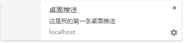

微博、网易邮箱、网页微信都有桌面推送的功能，通过Web Notifications就可以轻松实现。
<!-- more -->
#### 兼容性：

除了IE外，各大现代浏览器都对这个桌面推送有了基本的支持。
在移动端浏览器方面，可能因为平台的权限限制的原因目前只有firefox积极地支持这个属性。

#### 样例代码：

```javascript
if (window.Notification) {
        var ua = navigator.userAgent.toLowerCase();
        if (ua.indexOf('safari') != -1) {
            if (ua.indexOf('chrome') > -1) {
                // Chrome
                Notification.requestPermission().then(function(permission) {
                    if (permission == "granted") {
                        var notification = new Notification('桌面推送', {
                            body: '这是我的第一条桌面推送',
                            icon: 'some/icon/url'
                        });
                        notification.onclick = function() {
                            console.log('点击');
                            notification.close();
                        };
                    } else {
                        Notification.requestPermission();
                        console.log('没有权限,用户拒绝:Notification');
                    }
                });
            } else {
                // Safari
                Notification.requestPermission(function(permission) {
                    if (permission == "granted") {
                        var notification = new Notification('桌面推送', {
                            body: '这是我的第一条桌面推送',
                            icon: 'some/icon/url'
                        });
                        notification.onclick = function() {
                            console.log('点击');
                            notification.close();
                        };
                    } else {
                        Notification.requestPermission();
                        console.log('没有权限,用户拒绝:Notification');
                    }
                });
            }
        }   
    } else {
        console.log('不支持Notification');
    }
```

#### 说明：

1. Notification.requestPermission() 向用户申请权限函数，可以使用promise语法，也可以使用传统回调方式。


2. Notification.permission属性有三个值：**default**、**granted**和**denied**。当且仅当值为**default**时可以调用申请权限函数向用户申请权限。

3. 权限申请成功后，桌面消息推送实例创建：

	```javascript
	new Notification('title', {
	    body: '这是我的第一条桌面推送', // 消息体的内容
	    icon: 'some/icon/url', // 消息体的图标
	    sound :'...' // 消息体提示的声音
	});
	```

	

4. 实例的相关事件：**Notification.onclick**、**Notification.onerror**、**Notification.onclose**、**Notification.onshow**。

#### 手动设置权限

chrome用户请在 "设置->隐私设置->内容设置－>通知"选择网站域名点击允许
其他浏览器类似，请自己google
